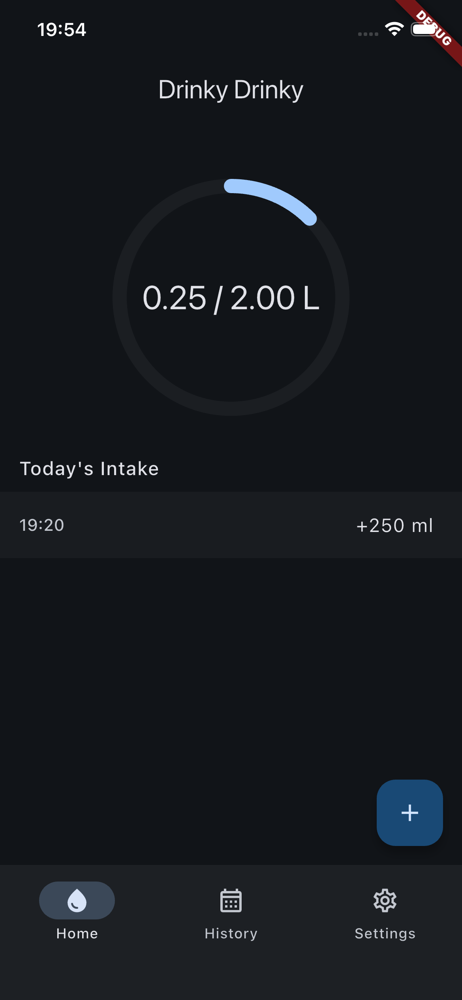
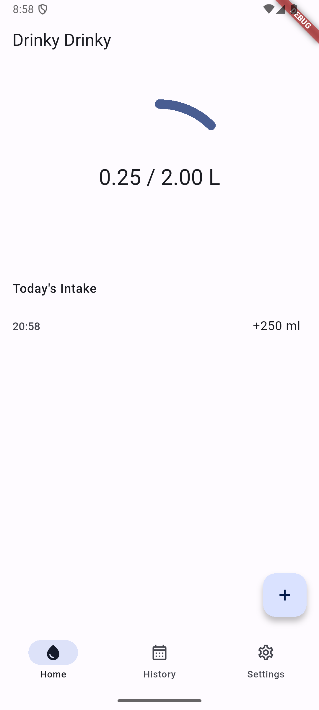

# 💧 Drinky Drinky

A Flutter mobile app that helps users track their daily water intake and stay hydrated. Users set a daily water goal, log drinks via a FAB-triggered bottom sheet with configurable preset buttons, review their history on a monthly calendar with color-coded days, and receive configurable reminder notifications. Runs on iOS and Android. Fully offline -- no backend, no user accounts, all data stored locally on device.

Built with Flutter, Riverpod, and Drift.

## Screenshots

| iOS | Android |
|-----|---------|
|  |  |

## Features

- Animated circular progress ring showing daily hydration progress
- Quick-add water intake via FAB-triggered bottom sheet with configurable presets
- Undo last intake entry
- Chronological timeline of today's individual intakes
- Configurable daily water target in ml
- Monthly calendar view with color-coded days (green = goal met, red = missed)
- Consecutive-day streak counter
- Configurable reminder notifications with DND window support
- Built-in hydration calculator (sex/weight/climate)
- Multilingual: English, Italian, French, Spanish
- Material You dynamic color theming on Android 12+
- Fully offline -- all data stored locally on device

## Getting Started

### Prerequisites

- Flutter SDK (>= 3.38.1) installed and on PATH

### Build and Run

1. Clone the repository:

   ```sh
   git clone https://github.com/newfla/drinky_drinky.git
   cd drinky_drinky
   ```

2. Install dependencies:

   ```sh
   flutter pub get
   ```

3. Run code generation (required -- the app uses Drift and Riverpod code generation):

   ```sh
   dart run build_runner build --delete-conflicting-outputs
   ```

4. Launch the app:

   ```sh
   flutter run
   ```

### Platform Requirements

| Platform | Requirement                                                                                             |
|----------|---------------------------------------------------------------------------------------------------------|
| Android  | compileSdk 37, minSdk 26 (Android 8.0+; required by permission_handler and flutter_local_notifications) |
| iOS      | iOS 16.0+                                                                                               |

## License

This project is not currently published under an open-source license.
